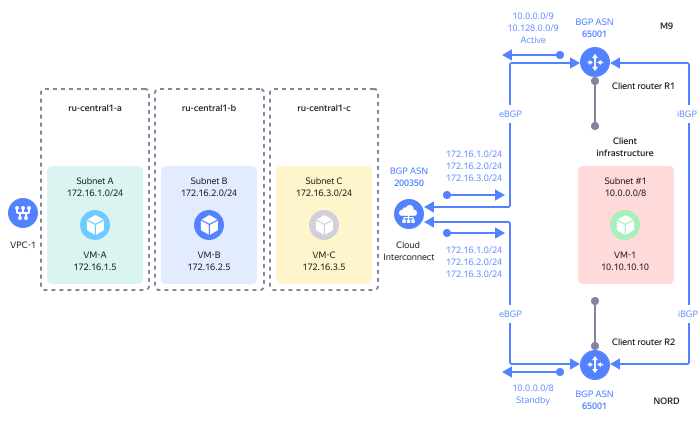
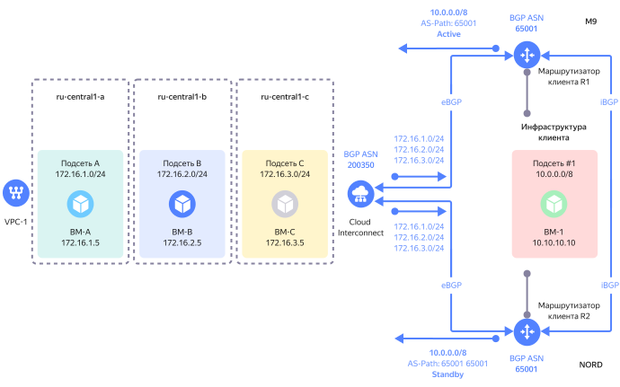
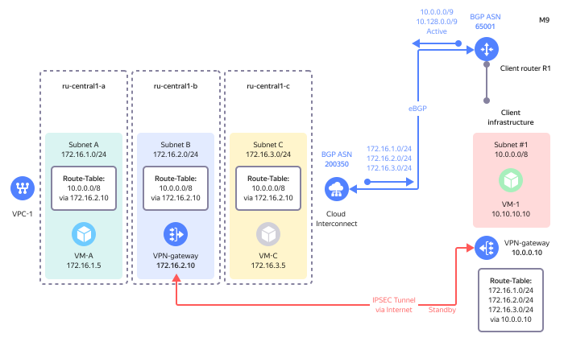
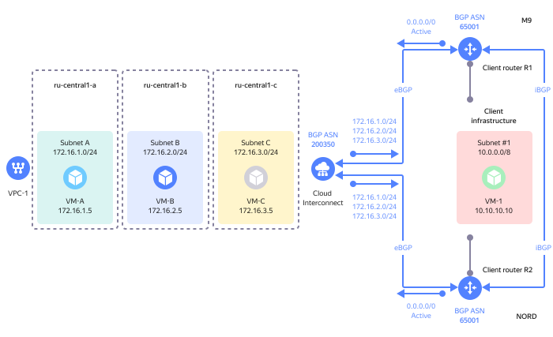
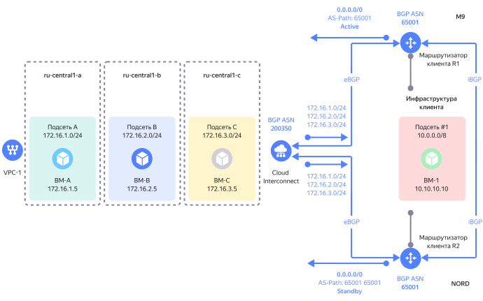

# Routing

When connecting a client infrastructure via {{ interconnect-full-name }}, you will typically need to set up traffic routing between the cloud resources and client infrastructure resources.

By **routing**, we mean a number of tools for traffic management in {{ yandex-cloud }}.


## General best practices for {{ interconnect-name }} routing {#cic-routing}

* Carefully plan your IP addressing before deploying your cloud resources. The IP addressing of {{ yandex-cloud }} subnets and those in the client infrastructure must not overlap.
* Always set up two channels for connecting via two [points of presence](pops.md).
* Use the same [BGP ASN](priv-con.md#bgp-asn) on client routers. If the [BGP ASN](priv-con.md#bgp-asn) values are different on different client routers, fault tolerance will not work.
* Each client router that sets [BGP connectivity](priv-con.md#bgp-peering) with the {{ yandex-cloud }} equipment over **eBGP** should also set BGP connectivity with other client routers over **iBGP**.
* Use prefixes of a different length on client routers for BGP announcements to distribute outgoing traffic from cloud subnets across communication circuits:
   * Prefix with a length of `/8` (short prefix) means the lowest route priority.
   * Prefix with a length of `/32` (long prefix) means the highest route priority.
* When selecting a communication circuit for outgoing traffic from the client infrastructure to cloud networks on a client router, you can use such option as a standard BGP attribute named `Local Preference`.
* You can use {{ interconnect-name }} and a [NAT gateway](../../vpc/operations/create-nat-gateway.md) simultaneously if client routers do not announce the default `0.0.0.0/0` route over BGP to {{ yandex-cloud }}. If the client routers do announce the default `0.0.0.0/0` route over BGP to {{ yandex-cloud }}, you cannot use a [NAT gateway](../../vpc/operations/create-nat-gateway.md).
* Currently, {{ yandex-cloud }} does not support distribution of outgoing traffic from cloud subnets to the client infrastructure based on the [BGP community](https://linkmeup.gitbook.io/sdsm/8.1.-ibgp/3.-atributy-bgp/4.-community/0.-teoriya) method.



You cannot use identical prefixes in {{ vpc-short-name }} route tables and client router announcements at the same time.




## Even traffic distribution (Active-Active) {#cic-routing-aa}

The example below shows even traffic distribution using two private connections set up through two points of presence.

The client infrastructure prefix, `10.0.0.0/8`, is announced over BGP by client routers through two points of presence towards {{ yandex-cloud }}. {{ yandex-cloud }} will perform ECMP load balancing and distribute traffic between the points of presence.


Such a balancing mode may lead to asymmetric traffic. For example, a request from the client infrastructure to cloud resources can be received through the `M9` point of presence, while the response will be sent through `NORD`.

Traffic asymmetry is allowed and handled correctly on the {{ yandex-cloud }} equipment, but may not be supported by certain types of equipment in the client infrastructure, such as firewalls.

To allow asymmetric traffic from {{ yandex-cloud }}, disable [RPF](https://en.wikipedia.org/wiki/Reverse-path_forwarding) on the network elements handling traffic in the client infrastructure. This will enable you to use all active {{ interconnect-name }} connections with a redundant connection through two or more points of presence.


## Prioritizing traffic by direction (Active-Standby) {#cic-routing-as}

To prioritize traffic by direction in {{ interconnect-name }}, you can use the following methods:

* [Longest prefix match (LPM)](#lpm1)
* [BGP AS path prepending](#prepend1)

The longest prefix match method has a higher priority than BGP AS path prepending when it comes to the algorithm for selecting the best route on routers. We recommend that you only choose one of the suggested methods rather than use both at the same time.

### Longest prefix match (LPM) method {#lpm1}

Below, you can see an example of prioritizing traffic through two private connections set up via two points of presence with the longest prefix match method.

A short prefix from the client infrastructure, `10.0.0.0/8`, is announced over BGP by a client router via the `NORD` point of presence to {{ yandex-cloud }}.

Two long (more specific) prefixes from the client infrastructure, `10.0.0.0/9` and `10.128.0.0/9`, are announced over BGP by a client router via the `M9` point of presence to {{ yandex-cloud }}.



Announcements via `M9` will be treated in {{ yandex-cloud }} as more specific, i.e., of higher priority.

This way, for all traffic from the `172.16.1.0/24`, `172.16.2.0/24`, and `172.16.3.0/24` cloud subnets to the client infrastructure, the system will select private connection to `M9`. If this connection fails, the traffic will be automatically switched over to the private connection to `NORD`.


### BGP AS path prepend method {#prepend1}

Below, you can see an example of prioritizing traffic through two private connections set up via two points of presence with the BGP AS path prepend method.

You can learn more about **BGP AS path prepending** [here](https://datatracker.ietf.org/doc/html/rfc4271#section-5.1.2).

The `10.0.0.0/8` prefix is announced from the client infrastructure over BGP by a client router (R1) via the `M9` point of presence to {{ yandex-cloud }}. The default `BGP AS-Path` attribute value will be `65001`, while the AS path length (amount of autonomous system number values) will be 1.

The same `10.0.0.0/8` prefix is announced from the client infrastructure over BGP by another client router (R2) via the `NORD` point of presence to {{ yandex-cloud }}.

Before announcing the prefix, the BGP routing policy on the R2 router adds the client's autonomous system number (BGP ASN) to the `AS-Path` BGP attribute value so that it will be equal to `65001 65001` and the AS path length will be 2. This update makes the prefix with the resulting AS path length less preferable for external BGP routers.



This way, the best route via `M9` will be selected on the {{ yandex-cloud }} side for the `10.0.0.0/8` prefix, while the route via `NORD` will be a backup one, as its AS path is longer.

For all traffic from the `172.16.1.0/24`, `172.16.2.0/24`, and `172.16.3.0/24` cloud subnets to the client infrastructure, the system will select private connection to `M9`. If this connection fails, the traffic will be automatically switched over to the private connection to `NORD`.


## Traffic reservation through VPN gateway {#cic-routing-vpn}

You can use a VPN gateway to make the {{ interconnect-name }} connection failsafe. For example, this might be an option when you cannot set up two physical channels via two points of presence to ensure a fault-tolerant connection of the client infrastructure to {{ yandex-cloud }}.





Two long prefixes from the client infrastructure, `10.0.0.0/9` and `10.128.0.0/9`, are announced over BGP by the client router via the `M9` point of presence to {{ yandex-cloud }}.

A backup connection from {{ yandex-cloud }} to the client infrastructure is set up by deploying a VPN gateway with IPSEC support in the `{{ region-id }}-b` availability zone and setting up static routing in the VPC network.

For each subnet with cloud resources in all three availability zones, one uses a single route table with the static route (prefix): `10.0.0.0/8 via 172.16.2.10`. Since this `/8` route (prefix) is shorter than the longer `/9` prefixes announced over BGP, it will have a lower priority while the {{ interconnect-name }} connection is running.

If the {{ interconnect-name }} connection fails, the longer `/9` prefixes will be removed from the cloud network and the entire traffic to the client infrastructure will be automatically routed via the shorter `/8` prefix using a static route to the VPN gateway.


## Static route priority {#cic-routing-static}

To set up traffic from the cloud network via a VPN gateway for a separate prefix while using the {{ interconnect-name }} connection for the remaining traffic, you can do the following:


A short prefix from the client infrastructure, `10.0.0.0/8`, is announced over BGP by a client router via the `M9` point of presence to {{ yandex-cloud }}.

A long prefix from the client infrastructure, `10.10.10.0/24`, is set up using a static route table to transmit traffic to the VPN gateway with the `172.16.2.10` IP address deployed in the `{{ region-id }}-b` availability zone.

This way, all traffic from the cloud network to the `10.0.0.0/8` client infrastructure will be transmitted via the {{ interconnect-name }} connection, while the traffic heading to the `10.10.10.0/24` subnet will run through the VPN gateway.


## Even traffic distribution for the 0.0.0.0/0 route {#cic-routing-default-aa}

In some cases, for example, to connect cloud resources to the internet via the client infrastructure, you need to set up `0.0.0.0/0` route announcement over BGP to {{ yandex-cloud }}.



The flowchart above shows how the traffic from cloud subnets connected to {{ interconnect-name }} is unconditionally routed to client routers through both points of presence.

[Security groups](../../vpc/concepts/security-groups.md) cannot be assigned to resources outside {{ yandex-cloud }}; therefore, the correct way to filter traffic is to use IPv4 prefixes rather than links to other security groups.
In this case, the customer can configure traffic filtering rules on client routers before sending it to the internet via their own NAT gateway without using the {{ yandex-cloud }} infrastructure.

## Prioritizing traffic by direction for 0.0.0.0/0 {#cic-routing-default-as}

To prioritize traffic by direction in {{ interconnect-name }}, you can use the following methods:

* [Longest prefix match (LPM)](#lpm1)
* [BGP AS path prepending](#prepend1)

The longest prefix match method has a higher priority than BGP AS path prepending when it comes to the algorithm for selecting the best route on routers. We recommend that you only choose one of the suggested methods rather than use both at the same time.

### Longest Prefix Match (LPM) method {#lpm2}

The example below shows how the traffic is prioritized using two private connections set up through two points of presence.

The default route from the client infrastructure, `0.0.0.0/0`, is announced over BGP by a client router via the `NORD` point of presence to {{ yandex-cloud }}.

Two long (more specific) prefixes from the client infrastructure, `0.0.0.0/1` and `128.0.0.0/1`, are announced over BGP by a client router via the `M9` point of presence to {{ yandex-cloud }}.


Announcements via `M9` will be treated in {{ yandex-cloud }} as more specific, i.e., of higher priority.

This way, for all traffic from the cloud subnets, the private connection to `M9`will be selected. If this connection fails, traffic will be automatically switched over to the private connection to `NORD`.


### BGP AS path prepend method {#prepend2}

Below, you can see an example of prioritizing traffic through two private connections set up via two points of presence with the BGP AS path prepend method.

You can learn more about BGP AS path prepending [here](https://datatracker.ietf.org/doc/html/rfc4271#section-5.1.2).

The default route from the client infrastructure, `0.0.0.0/0`, is announced over BGP by a client router via the `M9` point of presence to {{ yandex-cloud }}. The default `BGP AS-Path` attribute value will be `65001`, while the AS path length (amount of autonomous system number values) will be 1.

The same `0.0.0.0/0` prefix is announced from the client infrastructure over BGP by another client router (R2) via the `NORD` point of presence to {{ yandex-cloud }}.

Before announcing the prefix, the BGP routing policy on the R2 router adds the client's autonomous system number (BGP ASN) to the `AS-Path` BGP attribute value so that it will be equal to `65001 65001` and the AS path length will be 2. This update makes the prefix with the resulting AS path length less preferable for external BGP routers.



This way, the best route via `M9` will be selected on the {{ yandex-cloud }} side for the `0.0.0.0/0` prefix, while the route via `NORD` will be a backup one, as its AS path is longer.

For all traffic from the cloud subnets to the client infrastructure, the system will select private connection to `M9`. If this connection fails, the traffic will be automatically switched over to the private connection to `NORD`.


## Working with security groups {#cic-sg}

[Security groups](../../vpc/concepts/security-groups.md) are used to protect {{ yandex-cloud }} resources and cannot be used for filtering traffic outside {{ yandex-cloud }}.

Security group rules should be set up for the prefixes announced by client routers to {{ yandex-cloud }}. For example, to allow access from the client infrastructure to a web application (port 443) deployed in {{ yandex-cloud }}, set up a security group as follows:
```
ingress {
      protocol       = "TCP"
      port           = 443
      description    = "Allow ingress traffic from Interconnect to Web server"
      v4_cidr_blocks = ["172.16.1.5/32"]
    }
egress {
      protocol       = "ANY"
      description    = "We allow any egress traffic"
      v4_cidr_blocks = ["10.0.0.0/8"]
    }
```

The `Egress` security group rule allows any cloud resources to access resources in the client infrastructure on any port without any restriction.

If required, you can use more granular rules to only allow access to specific IP addresses or subnets and ports:

```
ingress {
      protocol       = "TCP"
      port           = 443
      description    = "Allow ingress traffic from Interconnect to Web server"
      v4_cidr_blocks = ["172.16.1.5/32"]
    }
egress {
      protocol       = "TCP"
      port           = 3389
      description    = "Allow RDP traffic to server behind Interconnect"
      v4_cidr_blocks = ["10.10.10.10/32"]
    }
```

