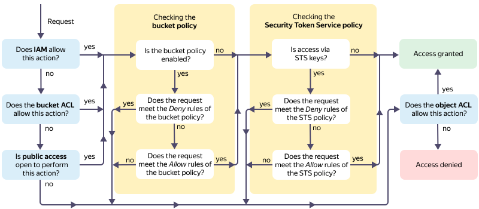

# Access management methods in {{ objstorage-name }}: Overview

{{ objstorage-name }} incorporates various access management methods:
* [{{ iam-full-name }} ({{ iam-short-name }})](#iam)
* [Access control list (ACL)](#acl)
* [Bucket policy](#policy)
* [Public access](#anonymous)
* [{{ sts-name }}](#sts)
* [Pre-signed URLs](#pre-signed)

The flow chart below shows how these methods work together in {{ objstorage-name }}.

All checks follow this algorithm:

1. _IAM_ and _bucket ACL_:
   * If the request passes the _IAM_ **or** _bucket ACL_ check, it is checked whether the _bucket access policy_ is enabled.
   * If the request fails the _IAM_ **and** _bucket ACL_ checks, the _public access_ to the bucket is checked.
1. _Public access_:
   * If public access to perform the action is enabled, it is checked whether the _bucket access policy_ is enabled.
   * If public access to perform the action is disabled, the next step is to check the access based on the _object ACL_.
1. _Bucket access policy_:
   * If access policy is enabled:
      1. If the request meets at least one of the `Deny` rules of the bucket policy, the next step is to check the access based on the _object ACL_.
      1. If the request meets at least one of the `Allow` rules of the bucket policy, it is checked whether the access is performed via _{{ sts-name }}_.
      1. If the request does not meet any of the rules of the bucket policy, the next step is to check the access based on the _object ACL_.
   * If the access policy is not enabled, it is checked whether access is performed via _{{ sts-name }}_.
1. _{{ sts-name }}_:
   * If the request is made using {{ sts-name }}:
      1. If the request meets at least one of the `Deny` policy rules for the temporary key, the next step is to check the access based on the _object ACL_.
      1. If the request meets at least one of the `Allow` policy rules for the temporary key, access will be allowed.
      1. If the request does not meet any of the policy rules for the temporary key, the next step is to check the access based on the _object ACL_.
   * If the request is made directly, access will be allowed.
1. _Object ACL_:
   * If the request passes the _object ACL_ check, access will be allowed.
   * If the request fails the _object ACL_ check, access will be denied.

## {{ iam-name }} {#iam}

[{{ iam-name }}](./index.md): Basic method for managing access in {{ yandex-cloud }} using role assignment. It defines basic access permissions. For more details, see [{#T}](./index.md#roles-list).

Access grantees include:
* Yandex account
* [Service account](../../iam/concepts/users/service-accounts.md)
* [Federated user](../../iam/concepts/federations.md)
* [User group](../../organization/operations/manage-groups.md)
* [System group](../../iam/concepts/access-control/system-group.md)

Access is granted to a [cloud](../../resource-manager/concepts/resources-hierarchy.md#cloud), [folder](../../resource-manager/concepts/resources-hierarchy.md#folder), or [bucket](../concepts/bucket.md).

## Access control list (ACL) {#acl}

An [access control list (ACL)](./acl.md) is a list of action permissions stored directly in {{ objstorage-name }}. It defines basic access permissions. ACL permissions for buckets and objects are different; see [{#T}](./acl.md#permissions-types) for details.



If you do not need to differentiate access to specific objects, we recommend using {{ iam-name }}.



Access grantees include:
* Yandex account
* [Service account](../../iam/concepts/users/service-accounts.md)
* [Federated user](../../iam/concepts/federations.md)
* [User group](../../organization/operations/manage-groups.md) (you can specify a user group using the {{ yandex-cloud }} CLI, AWS CLI, {{ TF }}, and the API, see [Editing a bucket ACL](../operations/buckets/edit-acl.md) and [Editing an object ACL](../operations/objects/edit-acl.md))
* [System group](../../iam/concepts/access-control/system-group.md)

Access is granted to a [bucket](../concepts/bucket.md) or [object](../concepts/object.md).

## Bucket policy {#policy}

A [bucket policy](./policy.md) is a list of rules that prohibit or allow [actions](../s3/api-ref/policy/actions.md) when certain [conditions](../s3/api-ref/policy/conditions.md) are met. Allows you to granularly differentiate access to buckets, objects and groups of objects.

Access grantees include:
* Yandex account
* [Service account](../../iam/concepts/users/service-accounts.md)
* [Federated user](../../iam/concepts/federations.md)
* [User group](../../organization/concepts/groups.md) (you can [specify](../operations/buckets/policy.md) a user group in the policy using the {{ yandex-cloud }} CLI, AWS CLI, {{ TF }}, and the API)
* Anonymous user

Access is granted to a [bucket](../concepts/bucket.md), [object](../concepts/object.md), or a group of objects.

## Public access {#anonymous}

[Public access](./public-access.md) defines access permissions for anonymous users to read objects, list of objects and bucket settings.

Access is granted to a [bucket](../concepts/bucket.md).



## {{ sts-name }} {#sts}



[{{ sts-name }}](./sts.md): {{ iam-name }} component to get temporary access keys compatible with [AWS S3 API](../s3/index.md).

With temporary keys, you can set up granular access to buckets for multiple users with a single service account.

## Pre-signed URLs {#pre-signed}

[Pre-signed URLs](./pre-signed-urls.md) are a way of giving anonymous users temporary access to certain actions in {{ objstorage-name }} using URLs that contain request authorization data in their parameters.

Access is granted to a [bucket](../concepts/bucket.md) or [object](../concepts/object.md).

### See also {#see-also}

* [{#T}](../operations/buckets/iam-access.md)
* [{#T}](../operations/buckets/edit-acl.md)
* [{#T}](../operations/objects/edit-acl.md)
* [{#T}](../operations/buckets/policy.md)
* [{#T}](../operations/buckets/bucket-availability.md)
* [{#T}](../operations/buckets/create-sts-key.md)