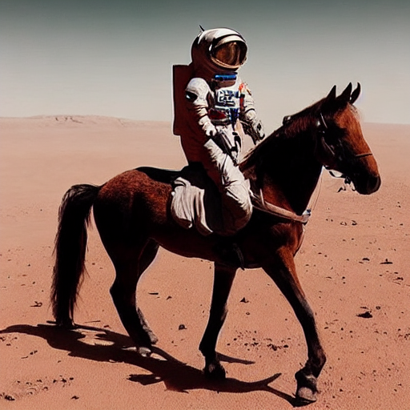

# Генерация изображения с помощью модели Stable Diffusion

В {{ ml-platform-name }} вы можете развернуть нейросеть на основе модели Stable Diffusion и генерировать изображения по их текстовому описанию.

[Stable Diffusion](https://github.com/CompVis/stable-diffusion) — это модель преобразования текста в изображение с открытым исходным кодом, разработанная [stability.ai](https://stability.ai/).

В этом руководстве вы сгенерируете изображение по текстовому описанию с помощью реализации модели Stable Diffusion в библиотеке [Diffusers](https://huggingface.co/docs/diffusers/index). Библиотека разработана с акцентом на удобство использования и настройки, а не на производительность.

Чтобы сгенерировать изображение с помощью модели Stable Diffusion:

1. [Подготовьте инфраструктуру](#infra).
1. [Создайте модель и сгенерируйте изображение](#generate).

Если созданные ресурсы вам больше не нужны, [удалите их](#clear-out).

## Перед началом работы {#before-you-begin}





### Необходимые платные ресурсы {#paid-resources}

В стоимость использования модели входит плата за запуск ячеек с кодом (см. [тарифы {{ ml-platform-name }}](../../datasphere/pricing.md)).

## Подготовьте инфраструктуру {#infra}

### Создайте проект {#create-project}

1. Откройте [главную страницу]({{ link-datasphere-main }}) {{ ml-platform-name }}.
1. На панели слева выберите  **{{ ui-key.yc-ui-datasphere.common.spaces }}**.
1. Выберите сообщество, в котором вы хотите создать проект.
1. На странице сообщества нажмите кнопку  **{{ ui-key.yc-ui-datasphere.projects.create-project }}**.
1. В открывшемся окне укажите имя `Stable Diffusion` и (опционально) описание проекта.
1. Нажмите кнопку **{{ ui-key.yc-ui-datasphere.common.create }}**.

### Создайте ноутбук и установите библиотеки {#install-libraries}



В этом практическом руководстве все вычисления выполняются на конфигурации g1.1, однако модель может быть запущена и на других конфигурациях. 



1. В интерфейсе {{ ml-platform-name }} откройте созданный проект.
1. Создайте новый ноутбук:

   1. На верхней панели в окне проекта нажмите **File** → **New** → **Notebook**.
   1. В открывшемся окне выберите ядро **{{ ml-platform-name }} Kernel**.

1. Установите библиотеку [Diffusers](https://huggingface.co/docs/diffusers/index). Вставьте в ячейку указанный ниже код и нажмите значок .

   ```python
   %pip install diffusers
   ```

1. Установите библиотеку [Transformers](https://huggingface.co/docs/transformers/index):

   ```python
   %pip install transformers
   ```

1. После завершения установки на верхней панели выберите **Kernel** ⟶ **Restart kernel...**

## Создайте модель и сгенерируйте изображение {#generate}

1. Импортируйте в проект библиотеки:

   ```python
   from diffusers import StableDiffusionPipeline
   import torch
   ```

1. Создайте модель:

   ```python
   model_id = "runwayml/stable-diffusion-v1-5"
   pipe = StableDiffusionPipeline.from_pretrained(model_id, torch_dtype=torch.float16)
   pipe = pipe.to("cuda")
   ```

1. Сгенерируйте изображение по его описанию:

   ```python
   prompt = "a photo of an astronaut riding a horse on mars"
   image = pipe(prompt).images[0]
   ```

1. Сохраните полученное изображение:

   ```python
   image.save("astronaut_rides_horse.png")
   ```

   Файл изображения появится рядом с ноутбуком. Результат:

   

## Как удалить созданные ресурсы {#clear-out}

Если вы больше не планируете работать с проектом `Stable Diffusion`, [удалите его](../../datasphere/operations/projects/delete.md#delete-project).
