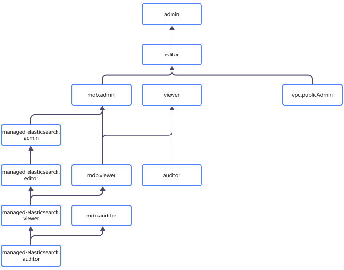

# Управление доступом к {{ mes-name }}



В этом разделе вы узнаете:

* [на какие ресурсы можно назначить роль](#resources);
* [какие роли действуют в сервисе](#roles-list);
* [какие роли необходимы](#required-roles) для того или иного действия.

Для использования сервиса необходимо авторизоваться в консоли управления с [аккаунтом на Яндексе](../../iam/concepts/users/accounts.md#passport) или с [федеративным аккаунтом](../../iam/concepts/users/accounts.md#saml-federation).



## На какие ресурсы можно назначить роль {#resources}



Чтобы разрешить доступ к ресурсам сервиса {{ mes-name }} (кластеры и хосты, резервные копии кластеров, учетные записи), назначьте пользователю нужные роли на каталог или облако, в котором содержатся эти ресурсы.

## Какие роли действуют в сервисе {#roles-list}

На диаграмме показано, какие роли есть в сервисе и как они наследуют разрешения друг друга. Например, в `{{ roles-editor }}` входят все разрешения `{{ roles-viewer }}`. После диаграммы дано описание каждой роли.

### Сервисные роли {#service-roles}

#### managed-elasticsearch.viewer {#managed-elasticsearch-viewer}



#### managed-elasticsearch.editor {#managed-elasticsearch-editor}



#### managed-elasticsearch.admin {#managed-elasticsearch-admin}



#### mdb.auditor {#mdb-auditor}



#### mdb.viewer {#mdb-viewer}



#### mdb.admin {#mdb-admin}



#### vpc.publicAdmin {#vpc-public-admin}



### Примитивные роли {#primitive-roles}



## Какие роли необходимы {#required-roles}

Чтобы пользоваться сервисом, необходима [роль](../../iam/concepts/access-control/roles.md) `{{ roles.mes.editor }}` или выше на каталог, в котором создается кластер. Роль `{{ roles.mes.viewer }}` позволит только просматривать список кластеров.

Вы всегда можете назначить роль, которая дает более широкие разрешения. Например, назначить `{{ roles.mes.admin }}` вместо `{{ roles.mes.editor }}`.

## Что дальше {#whats-next}

* [Как назначить роль](../../iam/operations/roles/grant.md).
* [Как отозвать роль](../../iam/operations/roles/revoke.md).
* [Подробнее об управлении доступом в {{ yandex-cloud }}](../../iam/concepts/access-control/index.md).
* [Подробнее о наследовании ролей](../../resource-manager/concepts/resources-hierarchy.md#access-rights-inheritance).

